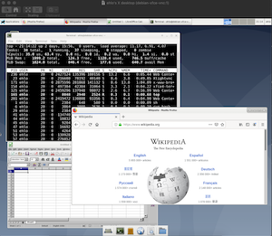

## debian-xfce-vnc

A minimal Debian 10 Desktop (with xfce, firefox, thunderbird, libre office), accessible via VNC.



 
### quickstart

```
docker run --name debian-xfce-vnc --hostname debian-xfce-vnc --shm-size 2g -p 5901:5901 -e VNCPASSWD=password -e VNCRES=1280x1024 -ti chko/debian-xfce-vnc
```

then connect a vnc client to `vnc://localhost:5901`

### config

#### env vars

| env var                | required | default               | description                                                                                                     | 
| ---------------------- | -------- | --------------------- | --------------------------------------------------------------------------------------------------------------- |
| VNCPASSWD=string       | no       | (autogenerated)       | The vnc password. If not set set a random one is set and printed to stdout at container creation                |
| VNCRES=800x600         | no       | 1280x800              | resolution                                                                                                      |
| VNCDEPTH=24            | no       | 24                    | color depth

#### useful parameters

| param example        | description                                                                                                                                   |
| -------------------- | --------------------------------------------------------------------------------------------------------------------------------------------- |
| --shm-size 2g        | shared memory size (`/dev/shm`). The default `64m` is too low for many GUI apps. Increase to value >=`2G` to avoid i.e. firefox crashes.      |

### data persistence 

- the default user's (`ehlo`) home dir is mapped to a Docker volume by default
- this user is unprivileged but has `sudo` privs (passwordless). However, changes made outside of the home dir (i.e. software installations with `apt-get`) will not persist.
  - (unless you commit the changes to a new image, i.e. via: `docker commit <containername> <newimagename>`)

### security
VNC connections are unencrypted. Intended for usage on a secure network (i.e. localhost).

